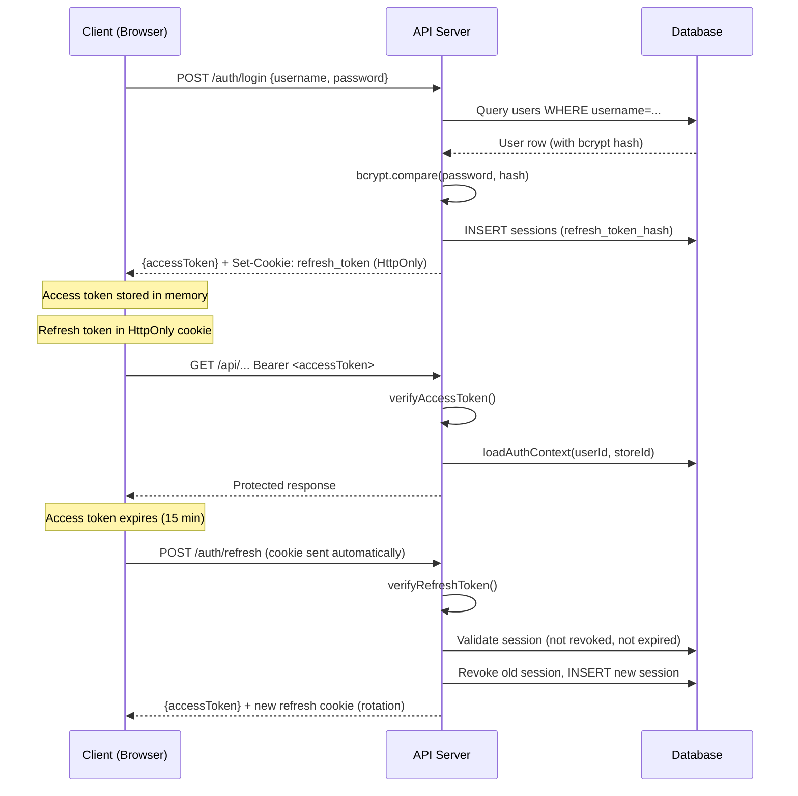

# Authentication & Authorization

> All details extracted from `artifacts/api-server/src/routes/auth.ts`, `src/middleware/auth.ts`, `src/lib/jwt.ts`, and `lib/shared/src/permissions.ts`.

---

## Authentication Overview

The system uses a **dual-token JWT strategy** with HttpOnly cookies:



---

## Token Details

| Token | Location | TTL | Storage |
|---|---|---|---|
| **Access Token** | `Authorization: Bearer <token>` | 15 minutes | JavaScript memory (never persisted) |
| **Refresh Token** | HttpOnly Cookie (`refresh_token`) | 7 days | Cookie + SHA-256 hash in `sessions` table |

### Why This Design?

- **Access token in memory:** Cannot be stolen by XSS (not in `localStorage`)
- **Refresh token in HttpOnly cookie:** Cannot be read by JavaScript; sent automatically by browser
- **Refresh token hashed in DB:** If DB is compromised, raw token remains secret
- **Session rotation:** Each refresh call revokes the old session and issues a new one, invalidating stolen refresh tokens

---

## Login Flow (Detailed)

```
POST /auth/login
│
├── 1. Validate body (Zod: LoginBody)
├── 2. Query user by username (isDeleted=false)
├── 3. If user not found → timing-safe dummy bcrypt compare → 401
├── 4. If lockedUntil > now → 423 (locked)
├── 5. If !isActive → 401
├── 6. bcrypt.compare(password, hash)
│   ├── FAIL:
│   │   ├── Increment failed_login_attempts
│   │   ├── If attempts >= 5 → SET locked_until = now + 15min
│   │   └── 401 or 423
│   └── SUCCESS:
│       ├── Reset failed_login_attempts = 0, locked_until = null
│       ├── Update last_login_at
│       ├── issueSession() → INSERT sessions row
│       ├── signAccessToken({sub, storeId, roleId})
│       ├── signRefreshToken({sub, storeId, sid})
│       ├── Set HttpOnly cookie
│       ├── writeAuditLog("auth.login")
│       └── Return {accessToken, user: currentUser}
```

---

## Session Management

### `issueSession()` function:

1. INSERT into `sessions` with `refresh_token_hash = "pending"` (to get the session ID)
2. Sign refresh token with `{ sub: userId, storeId, sid: sessionId }`
3. UPDATE `sessions.refresh_token_hash` = SHA-256(refreshToken)
4. Return the raw refresh token (sent to client as cookie)

### Refresh Token Rotation:

On `POST /auth/refresh`:
1. Read cookie → `verifyRefreshToken()` (validates JWT signature + expiry)
2. Load session by `sid` from DB
3. Validate: session not revoked, not expired, `hash(token) === stored_hash`
4. REVOKE old session (`revokedAt = now`)
5. Issue brand new session → new access + refresh tokens

---

## Request Authentication Middleware

Every protected route uses `requireAuth` from [`middleware/auth.ts`](file:///c:/Users/moham/Downloads/Shoe-Store-Design/Shoe-Store-Design/artifacts/api-server/src/middleware/auth.ts):

```typescript
// 1. Extract Bearer token from Authorization header
// 2. verifyAccessToken() — validates JWT signature, expiry
// 3. loadAuthContext(userId, storeId):
//    - JOIN users + roles + stores
//    - Check isDeleted=false, isActive=true
//    - Verify storeId matches token claim (tenant isolation)
// 4. Attach ctx to req.auth
// 5. Call next()
```

**Tenant Isolation:** `storeId` always comes from the **verified JWT**, never from client input. This guarantees a user can only access their own store's data.

---

## Authorization (RBAC)

### Permission System

Defined in [`lib/shared/src/permissions.ts`](file:///c:/Users/moham/Downloads/Shoe-Store-Design/Shoe-Store-Design/lib/shared/src/permissions.ts):

```
Modules: dashboard, sales, customers, suppliers, purchases,
         products, inventory, finance, treasury, reports,
         users, roles, audit, settings

Keys follow: module.action
Example: "sales.create", "users.delete", "reports.inventory"
```

**Total permissions:** 40+ granular keys

### Permission Check Logic

```typescript
function hasPermission(granted, required) {
  if (granted.includes("*"))        return true;  // Admin wildcard
  if (granted.includes(required))   return true;  // Exact match
  if (granted.includes("module.*")) return true;  // Module wildcard
  return false;
}
```

### Route Guards

```typescript
// Single permission
router.get("/users", requireAuth, requirePermission("users.view"), ...)

// Any of multiple permissions  
router.get("/finance", requireAuth, requireAnyPermission(["finance.view", "expenses.create"]), ...)
```

### Frontend Permission Gate

In [`App.tsx`](file:///c:/Users/moham/Downloads/Shoe-Store-Design/Shoe-Store-Design/artifacts/pos/src/App.tsx):

```tsx
<PermissionGate permission="sales.create">
  <POSPage />
</PermissionGate>
```

Redirects to `/dashboard` if permission check fails — UI mirrors server-side guards.

---

## Default Roles (Seeded at Setup)

| Role | Key | Permissions |
|---|---|---|
| **Admin** | `admin` | `["*"]` — everything |
| **Manager** | `manager` | ~30 permissions (all except user management write, roles manage) |
| **Cashier** | `cashier` | `["expenses.create"]` only (very limited) |
| **Inventory Staff** | `inventory_staff` | Products, purchases, inventory, basic reports |
| **Accountant** | `accountant` | Finance, treasury, reports, customers/suppliers (no sales create) |

> Source: [`lib/shared/src/roles.ts`](file:///c:/Users/moham/Downloads/Shoe-Store-Design/Shoe-Store-Design/lib/shared/src/roles.ts)

---

## Account Lockout

| Rule | Value | Source |
|---|---|---|
| Max failed attempts | 5 | `config.auth.maxFailedAttempts` |
| Lockout duration | 15 minutes | `config.auth.lockoutMinutes` |
| Lockout HTTP status | 423 (Locked) | |

**Timing-safe:** When a username is not found, a dummy `bcrypt.compare()` is still executed to prevent timing attacks that could enumerate valid usernames.

---

## First-Run Setup

```
POST /auth/setup
│
├── Guard: isSetupComplete must be false
├── Transaction:
│   ├── INSERT stores (name, currency, tax, etc.)
│   ├── INSERT roles (5 default roles from DEFAULT_ROLES constant)
│   ├── INSERT users (admin account)
│   └── INSERT audit_logs ("setup.completed")
└── Response: {storeId, message}
```

After setup, `is_setup_complete = true` forever — this endpoint becomes a 409 on subsequent calls.

---

## Security Notes

| Concern | Mitigation |
|---|---|
| XSS token theft | Access token in memory only (never localStorage) |
| CSRF on refresh | `sameSite: "strict"` cookie flag |
| Token replay | SHA-256 hash stored; raw token only in cookie |
| Brute force | 5-attempt lockout for 15 min |
| Stale sessions | `revokedAt` field; DB-side validation on every refresh |
| Tenant bleed | `storeId` always from JWT, never from client input |
| Password storage | bcrypt with cost factor 12 |
