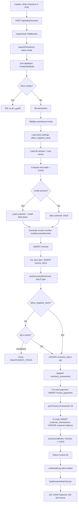
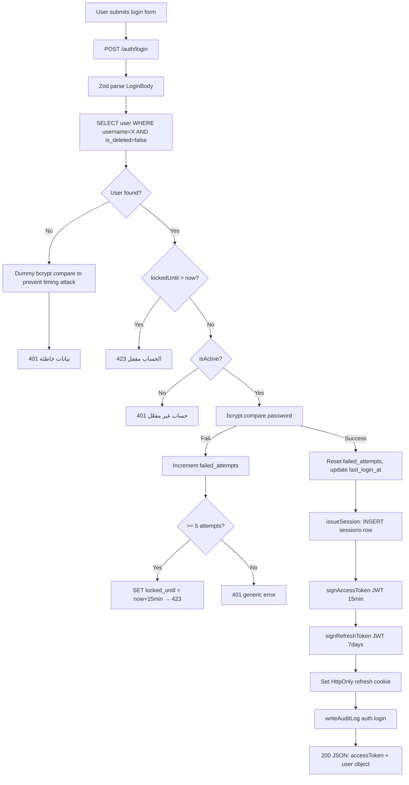
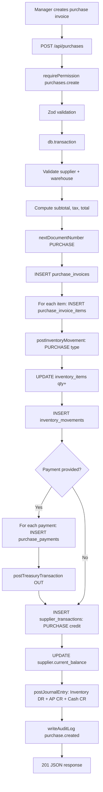
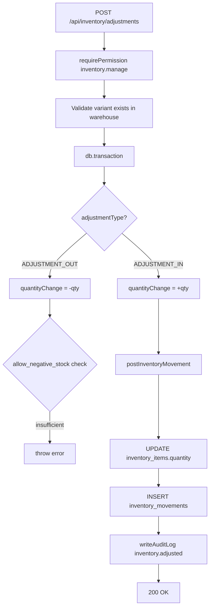
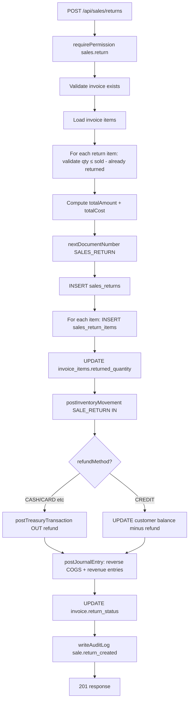
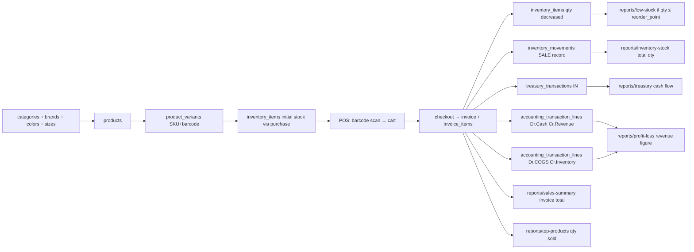
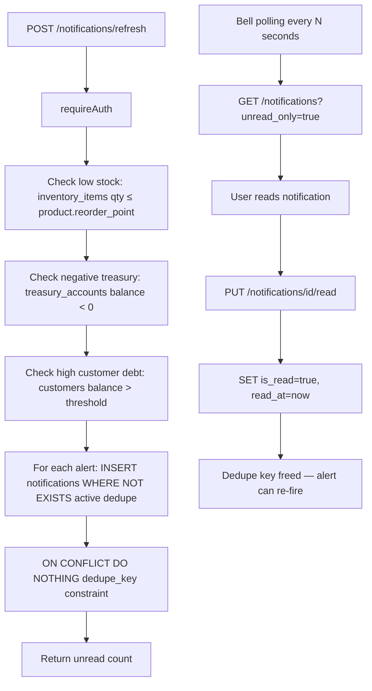

# Code Flow

> Complete request-to-response flows for the most important operations.

---

## 1. Create Sale (Checkout)

**Key files:**
- [`routes/sales.ts L266-580`](file:///c:/Users/moham/Downloads/Shoe-Store-Design/Shoe-Store-Design/artifacts/api-server/src/routes/sales.ts)
- [`lib/inventory.ts`](file:///c:/Users/moham/Downloads/Shoe-Store-Design/Shoe-Store-Design/artifacts/api-server/src/lib/inventory.ts)
- [`lib/treasury.ts`](file:///c:/Users/moham/Downloads/Shoe-Store-Design/Shoe-Store-Design/artifacts/api-server/src/lib/treasury.ts)
- [`lib/accounting.ts`](file:///c:/Users/moham/Downloads/Shoe-Store-Design/Shoe-Store-Design/artifacts/api-server/src/lib/accounting.ts)

---

## 2. Login Flow

---

## 3. Purchase Invoice (Receive Stock)

---

## 4. Token Refresh

---

## 5. Inventory Adjustment (Manual)

---

## 6. Sales Return

---

## 7. Data Flow: Product → Sale → Report

---

## 8. Notification Generation Flow

