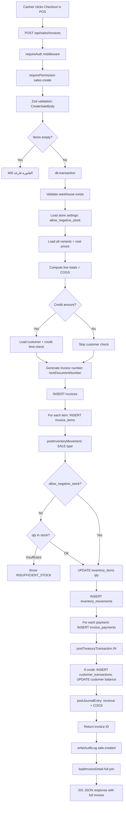
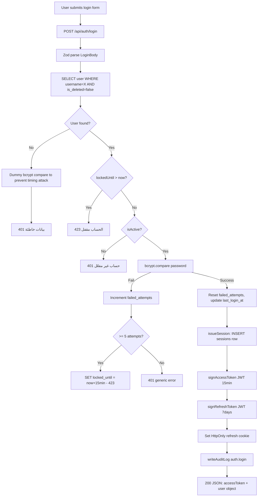
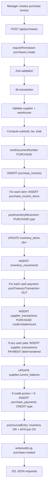
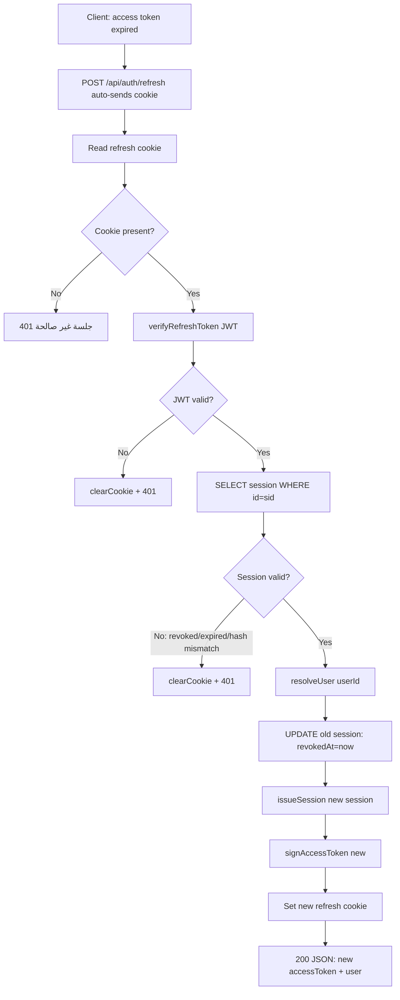
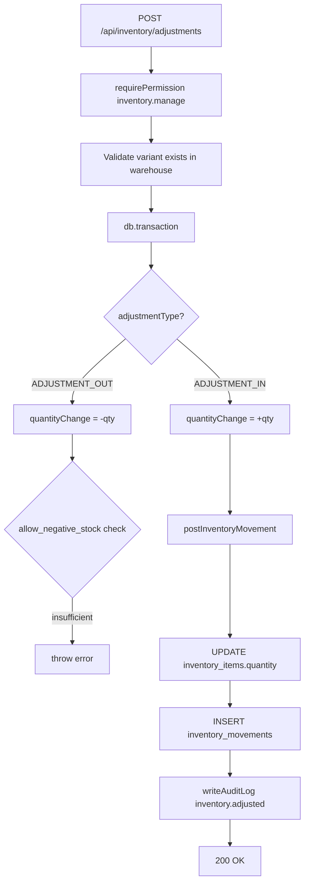
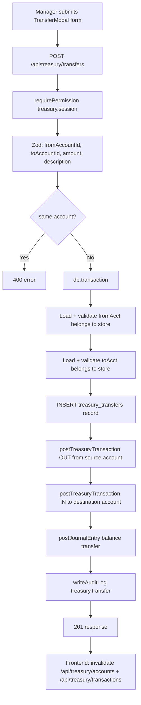
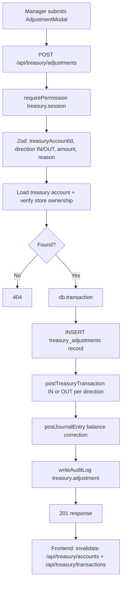
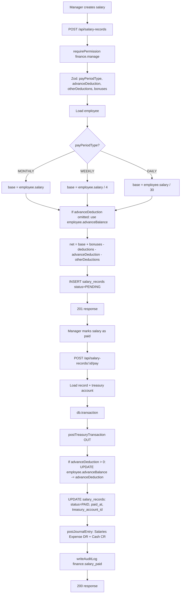
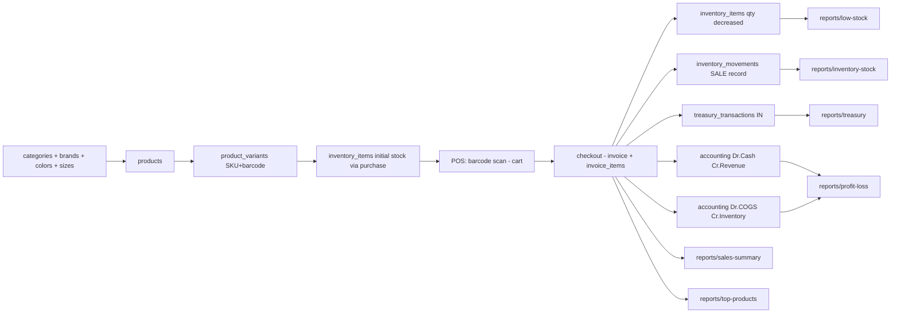
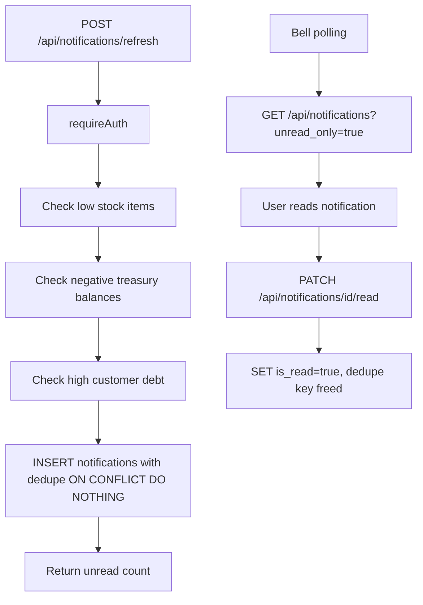

# Code Flow

> Complete request-to-response flows for the most important operations.

---

## 1. Create Sale (Checkout)

**Key files:**
- [`routes/sales.ts`](file:///d:/Erp/ERP/artifacts/api-server/src/routes/sales.ts)
- [`lib/inventory.ts`](file:///d:/Erp/ERP/artifacts/api-server/src/lib/inventory.ts)
- [`lib/treasury.ts`](file:///d:/Erp/ERP/artifacts/api-server/src/lib/treasury.ts)
- [`lib/accounting.ts`](file:///d:/Erp/ERP/artifacts/api-server/src/lib/accounting.ts)

---

## 2. Login Flow

---

## 3. Purchase Invoice (Receive Stock)

> **Note:** Both cash and credit purchases always create a PURCHASE supplier transaction for the full amount, ensuring all invoices appear in the supplier statement.

---

## 4. Token Refresh

---

## 5. Inventory Adjustment (Manual)

---

## 6. Sales Return

---

## 7. Treasury Transfer (Between Accounts)

**Key file:** [`routes/treasury.ts:407`](file:///d:/Erp/ERP/artifacts/api-server/src/routes/treasury.ts)

---

## 8. Treasury Adjustment (Cash Reconciliation)

**Key file:** [`routes/treasury.ts:534`](file:///d:/Erp/ERP/artifacts/api-server/src/routes/treasury.ts)

---

## 9. Salary Record Creation and Payment

**Key file:** [`routes/finance.ts`](file:///d:/Erp/ERP/artifacts/api-server/src/routes/finance.ts)

---

## 10. Data Flow: Product → Sale → Report

---

## 11. Notification Generation Flow

