# Database Analysis

> Extracted entirely from `lib/db/src/schema/`. All 34 tables documented with columns, types, indexes, and relationships.

---

## Database Technology

- **Engine:** SQLite (via `libsql` — Turso's WAL-optimized fork)
- **ORM:** Drizzle ORM with TypeScript type inference
- **ID Strategy:** `crypto.randomUUID()` — UUIDs for all primary keys
- **Monetary Storage:** `text` (decimal string, e.g., `"1250.50"`) to avoid floating-point errors
- **Timestamps:** `integer` in millisecond epoch mode (`timestamp_ms`)
- **Soft Deletes:** Used on `users` (`is_deleted`), products (`is_active`)
- **Tenant Isolation:** Every table has `store_id` FK for multi-tenant readiness

---

## ER Diagram (High-Level)

```mermaid
erDiagram
    stores ||--o{ roles : "has"
    stores ||--o{ users : "has"
    stores ||--o{ warehouses : "has"
    stores ||--o{ categories : "has"
    stores ||--o{ brands : "has"
    stores ||--o{ colors : "has"
    stores ||--o{ sizes : "has"
    stores ||--o{ products : "has"
    stores ||--o{ customers : "has"
    stores ||--o{ suppliers : "has"
    stores ||--o{ treasury_accounts : "has"
    stores ||--o{ accounting_accounts : "has"
    stores ||--o{ store_settings : "has 1"

    roles ||--o{ users : "assigned_to"
    users ||--o{ sessions : "owns"
    users ||--o{ audit_logs : "creates"
    users ||--o{ invoices : "creates"

    products ||--o{ product_variants : "has"
    categories ||--o{ products : "classifies"
    brands ||--o{ products : "brands"
    colors ||--o{ product_variants : "color"
    sizes ||--o{ product_variants : "size"

    product_variants ||--o{ inventory_items : "stocked_in"
    product_variants ||--o{ inventory_movements : "tracks"
    warehouses ||--o{ inventory_items : "holds"

    invoices ||--o{ invoice_items : "contains"
    invoices ||--o{ invoice_payments : "paid_by"
    invoices ||--o{ sales_returns : "returned_via"
    customers ||--o{ invoices : "buys"
    customers ||--o{ customer_transactions : "has_ledger"

    purchase_invoices ||--o{ purchase_invoice_items : "contains"
    purchase_invoices ||--o{ purchase_payments : "paid_by"
    purchase_invoices ||--o{ purchase_returns : "returned_via"
    suppliers ||--o{ purchase_invoices : "supplies"
    suppliers ||--o{ supplier_transactions : "has_ledger"

    treasury_accounts ||--o{ treasury_transactions : "records"
    treasury_accounts ||--o{ treasury_sessions : "has"

    accounting_accounts ||--o{ accounting_transaction_lines : "in"
    accounting_transactions ||--o{ accounting_transaction_lines : "has"

    employees ||--o{ salary_records : "has"
    employees ||--o{ employee_advances : "has"

    warehouses ||--o{ warehouse_transfers : "from"
    warehouses ||--o{ warehouse_transfers : "to"
    warehouse_transfers ||--o{ warehouse_transfer_items : "has"

    stock_counts ||--o{ stock_count_items : "has"
```

---

## Table Reference

### `stores` — Tenant Root

| Column | Type | Constraints | Description |
|---|---|---|---|
| `id` | text (UUID) | PK | Store identifier |
| `name` | text | NOT NULL | Store display name |
| `phone` | text | | Contact phone |
| `address` | text | | Physical address |
| `city` | text | | City |
| `currency` | text | NOT NULL, DEFAULT 'EGP' | ISO currency code |
| `tax_rate` | text | NOT NULL, DEFAULT '0' | Default tax rate (decimal string) |
| `logo_url` | text | | Logo image URL |
| `receipt_printer_width` | text | NOT NULL, DEFAULT '80mm' | Thermal printer width |
| `receipt_paper_type` | text | | Paper type identifier |
| `is_setup_complete` | integer (bool) | NOT NULL, DEFAULT false | Gates setup wizard |
| `created_at` | integer (ms) | NOT NULL | |
| `updated_at` | integer (ms) | NOT NULL | Auto-updated |

**Indexes:** None (single-row table in practice)

---

### `roles` — RBAC Roles

| Column | Type | Constraints |
|---|---|---|
| `id` | text (UUID) | PK |
| `store_id` | text | FK → stores.id RESTRICT |
| `name` | text | NOT NULL |
| `name_ar` | text | Arabic label |
| `permissions` | text (JSON array) | NOT NULL, DEFAULT [] |
| `is_system` | integer (bool) | NOT NULL, DEFAULT false |
| `created_at` / `updated_at` | integer (ms) | |

**Indexes:** `UNIQUE (store_id, name)`

---

### `users` — Application Users

| Column | Type | Constraints |
|---|---|---|
| `id` | text (UUID) | PK |
| `store_id` | text | FK → stores.id RESTRICT |
| `role_id` | text | FK → roles.id RESTRICT |
| `username` | text | NOT NULL |
| `password_hash` | text | NOT NULL (bcrypt) |
| `full_name` | text | NOT NULL |
| `phone` | text | |
| `email` | text | |
| `is_active` | integer (bool) | NOT NULL, DEFAULT true |
| `failed_login_attempts` | integer | NOT NULL, DEFAULT 0 |
| `locked_until` | integer (ms) | Lockout expiry |
| `last_login_at` | integer (ms) | |
| `is_deleted` | integer (bool) | NOT NULL, DEFAULT false (soft delete) |
| `deleted_at` | integer (ms) | |
| `created_at` / `updated_at` | integer (ms) | |

**Indexes:** `UNIQUE (store_id, username)`

---

### `sessions` — JWT Refresh Sessions

| Column | Type | Constraints |
|---|---|---|
| `id` | text (UUID) | PK |
| `store_id` | text | FK → stores.id |
| `user_id` | text | FK → users.id |
| `refresh_token_hash` | text | NOT NULL (SHA-256 of token) |
| `user_agent` | text | Browser UA string |
| `ip_address` | text | |
| `expires_at` | integer (ms) | NOT NULL |
| `revoked_at` | integer (ms) | NULL = active |
| `created_at` | integer (ms) | |

---

### `audit_logs` — Immutable Audit Trail

| Column | Type | Description |
|---|---|---|
| `id` | text (UUID) | PK |
| `store_id` | text | FK → stores.id |
| `user_id` | text | FK → users.id |
| `action` | text | e.g. `auth.login`, `sale.created` |
| `entity_type` | text | e.g. `user`, `invoice` |
| `entity_id` | text | |
| `old_value` | text (JSON) | Before-state snapshot |
| `new_value` | text (JSON) | After-state snapshot |
| `ip_address` | text | |
| `created_at` | integer (ms) | |

**Indexes:** `(store_id, created_at)`, `(entity_type, entity_id)`

---

### `categories` / `brands` / `colors` / `sizes` — Catalog Master Data

All follow the same pattern:

| Column | Type | Notes |
|---|---|---|
| `id` | UUID PK | |
| `store_id` | FK → stores | |
| `name` | text NOT NULL | Arabic |
| `name_en` | text | English (categories, brands, colors) |
| `is_active` | bool | Soft delete |
| `created_at` / `updated_at` | ms timestamps | |

**Extra for `colors`:** `hex` text (CSS hex code)  
**Extra for `sizes`:** `system` text (EU/US/UK), `sort_order` integer  
**Unique:** `(store_id, name)` on all; `(store_id, system, name)` on sizes

---

### `products` — Base Product

| Column | Type | Description |
|---|---|---|
| `id` | UUID PK | |
| `store_id` | FK → stores | |
| `name` | text NOT NULL | Arabic product name |
| `name_en` | text | English name |
| `category_id` | FK → categories RESTRICT | |
| `brand_id` | FK → brands RESTRICT | Optional |
| `description` | text | |
| `base_price` | text | Default selling price (decimal) |
| `base_cost_price` | text | Default cost price (decimal) |
| `reorder_point` | integer | Minimum stock before alert |
| `barcode` | text | Product-level barcode (optional) |
| `is_active` | bool | |

**Indexes:** `(store_id, name)`, `(store_id, category_id)`

---

### `product_variants` — SKU-Level Variant

| Column | Type | Description |
|---|---|---|
| `id` | UUID PK | |
| `product_id` | FK → products RESTRICT | Parent product |
| `store_id` | FK → stores | |
| `color_id` | FK → colors RESTRICT | |
| `size_id` | FK → sizes RESTRICT | |
| `sku` | text NOT NULL | Auto-generated (productName-color-size) |
| `barcode` | text NOT NULL | Auto-generated EAN-13 |
| `selling_price` | text | NULL = inherit product base_price |
| `cost_price` | text | NULL = inherit product base_cost_price |
| `is_active` | bool | |

**Unique Indexes:** `(store_id, sku)`, `(store_id, barcode)`, `(product_id, color_id, size_id)`

---

### `warehouses`

| Column | Type | |
|---|---|---|
| `id` | UUID PK | |
| `store_id` | FK → stores | |
| `name` | text NOT NULL | |
| `location` | text | |
| `is_active` | bool | |

---

### `inventory_items` — Cached Stock (Read-Fast)

| Column | Type | Description |
|---|---|---|
| `id` | UUID PK | |
| `store_id` | FK → stores | |
| `variant_id` | FK → product_variants RESTRICT | |
| `warehouse_id` | FK → warehouses RESTRICT | |
| `quantity` | integer | Current on-hand (AUTHORITATIVE for display) |

**Unique:** `(variant_id, warehouse_id)` — one row per variant per warehouse

> ⚠️ This table is a **cache** — the authoritative history is `inventory_movements`. Both are updated atomically in the same transaction.

---

### `inventory_movements` — Immutable Ledger

| Column | Type | Description |
|---|---|---|
| `id` | UUID PK | |
| `store_id` | FK → stores | |
| `variant_id` | FK → product_variants | |
| `warehouse_id` | FK → warehouses | |
| `type` | enum | SALE, SALE_RETURN, PURCHASE, PURCHASE_RETURN, ADJUSTMENT_IN, ADJUSTMENT_OUT, TRANSFER_OUT, TRANSFER_IN, STOCK_COUNT_CORRECTION |
| `quantity_change` | integer | Positive = IN, Negative = OUT |
| `balance_after` | integer | On-hand quantity after this movement |
| `reference_type` | text | e.g. "SALE", "PURCHASE" |
| `reference_id` | text | FK to source document |
| `notes` | text | |
| `created_by` | FK → users | |
| `created_at` | integer (ms) | |

**Never updated or deleted.**

---

### `invoices` — Sales Invoice Header

| Column | Type | Description |
|---|---|---|
| `id` | UUID PK | |
| `store_id` | FK → stores | |
| `invoice_number` | text | Human-readable sequence (e.g. "INV-00042") |
| `invoice_barcode` | text | Scannable for returns lookup |
| `customer_id` | FK → customers | Optional (walk-in = NULL) |
| `warehouse_id` | FK → warehouses | Stock deducted from here |
| `sale_type` | enum CASH\|CREDIT | CREDIT when any amount on account |
| `subtotal` | text | Gross before discounts |
| `discount_amount` | text | Total discounts |
| `tax_amount` | text | Calculated tax |
| `total_amount` | text | Final amount |
| `total_cost` | text | COGS for profit calculation |
| `amount_paid` | text | Non-credit portion collected |
| `change_due` | text | Change returned to customer |
| `payment_status` | enum PAID\|PARTIAL\|UNPAID | |
| `return_status` | enum NONE\|PARTIAL\|FULL | |
| `notes` | text | |
| `created_by` | FK → users | Cashier |
| `created_at` | integer (ms) | |

---

### `invoice_items` — Line Items

| Column | Type | Description |
|---|---|---|
| `invoice_id` | FK → invoices CASCADE | |
| `variant_id` | FK → product_variants RESTRICT | |
| `quantity` | integer | |
| `unit_price` | text | Snapshot at time of sale |
| `unit_cost` | text | Snapshot for COGS |
| `discount_amount` | text | Per-line discount |
| `line_total` | text | (qty × price) - discount |
| `returned_quantity` | integer | DEFAULT 0; incremented on return |

---

### `invoice_payments` — Payment Tenders

| Column | Type | Description |
|---|---|---|
| `invoice_id` | FK → invoices CASCADE | |
| `method` | enum CASH\|CARD\|INSTAPAY\|WALLET\|CREDIT | |
| `treasury_account_id` | FK → treasury_accounts | NULL for CREDIT method |
| `amount` | text | Amount in this tender |

---

### `sales_returns` / `sales_return_items`

Mirror invoices/invoice_items pattern but for returns. Links back to original `invoice_id` and `invoice_item_id`.

---

### `suspended_orders` — Parked Carts

| Column | Type | Description |
|---|---|---|
| `id` | UUID PK | |
| `store_id` | FK → stores | |
| `label` | text | Optional cart name |
| `customer_id` | FK → customers | Optional |
| `cart` | text (JSON) | Full cart state serialized |
| `item_count` | integer | |
| `total_amount` | text | |
| `created_by` | FK → users | |

---

### `purchase_invoices` — Purchase Header

Similar to `invoices` but for buying from suppliers:

| Column | Extra |
|---|---|
| `supplier_id` | FK → suppliers |
| `supplier_invoice_number` | Supplier's own invoice ref |
| `invoice_date` | Date of purchase (text ISO date) |
| `due_date` | Payment due date |
| `remaining_balance` | Outstanding amount |
| `status` | enum DRAFT\|CONFIRMED\|PARTIAL\|PAID |

---

### `treasury_accounts` — Money Drawers

| Column | Type | Description |
|---|---|---|
| `type` | enum CASH\|CARD\|INSTAPAY\|WALLET | One per type per store |
| `name` | text | Display name |
| `balance` | text | Cached running balance |

---

### `treasury_sessions` — Cash Shifts

| Column | Description |
|---|---|
| `opening_balance` | Cash counted at shift open |
| `expected_closing_balance` | Calculated from transactions |
| `actual_closing_balance` | Cash counted at close |
| `variance` | expected - actual |
| `status` | OPEN\|CLOSED |

---

### `treasury_transactions` — Immutable Money Ledger

| Column | Description |
|---|---|
| `direction` | IN (money received) or OUT (money paid) |
| `amount` | Transaction amount |
| `balance_after` | Account balance after this tx |
| `reference_type` | SALE, EXPENSE, SALARY, WITHDRAWAL, etc. |
| `reference_id` | FK to source document |

**Never updated or deleted.**

---

### `accounting_accounts` — Chart of Accounts

Seeded per store with standard codes:

| Code | Name | Type |
|---|---|---|
| 1000 | Cash | ASSET |
| 1010 | Card Receivable | ASSET |
| 1020 | InstaPay | ASSET |
| 1030 | Wallet | ASSET |
| 1100 | Accounts Receivable | ASSET |
| 1200 | Inventory | ASSET |
| 2000 | Accounts Payable | LIABILITY |
| 3000 | Owner Equity | EQUITY |
| 4000 | Sales Revenue | REVENUE |
| 5000 | Cost of Goods Sold | EXPENSE |
| 5100 | Operating Expenses | EXPENSE |
| 5200 | Salaries Expense | EXPENSE |

---

### `accounting_transactions` & `accounting_transaction_lines`

Every financial event creates one `accounting_transaction` header with ≥2 `accounting_transaction_lines` (debit + credit sides). Sum of debits always equals sum of credits per transaction.

---

### `expense_categories` / `expenses`

Expense category master data and individual expense records. Each expense links to a treasury account (money OUT).

---

### `employees` / `salary_records` / `employee_advances`

Staff HR data, monthly salary payment records (PENDING → PAID), and cash advances with running balance.

---

### `equity_movements`

Owner WITHDRAWAL (drawings) or DEPOSIT (capital injection). Links to treasury account.

---

### `notifications`

Per-user in-app alerts. Types: LOW_STOCK, NEGATIVE_TREASURY, CUSTOMER_DEBT, SUPPLIER_DEBT, DAILY_SUMMARY, SYSTEM.
Deduplication via partial unique index on `(user_id, dedupe_key) WHERE is_read = false`.

---

### `store_settings`

One row per store. Controls:
- `tax_enabled`, `tax_rate`, `tax_inclusive`
- `receipt_size`, `receipt_footer`
- `numeral_format` (western/arabic)
- `allow_negative_stock`
- `allow_below_cost_discount`
- `allow_negative_treasury`
- `require_session_for_cash`

---

### `number_sequences`

Per-store, per-kind monotonic counters. Kinds: SALE, SALES_RETURN, PURCHASE, PURCHASE_RETURN, TRANSFER, STOCK_COUNT.

---

## Summary: All 34 Tables

| # | Table | Module | Type |
|---|---|---|---|
| 1 | stores | Core | Master |
| 2 | roles | Auth | Master |
| 3 | users | Auth | Master |
| 4 | sessions | Auth | Operational |
| 5 | audit_logs | Auth | Immutable Ledger |
| 6 | categories | Catalog | Master |
| 7 | brands | Catalog | Master |
| 8 | colors | Catalog | Master |
| 9 | sizes | Catalog | Master |
| 10 | products | Products | Master |
| 11 | product_variants | Products | Master |
| 12 | warehouses | Inventory | Master |
| 13 | inventory_items | Inventory | Cached State |
| 14 | inventory_movements | Inventory | Immutable Ledger |
| 15 | warehouse_transfers | Inventory | Operational |
| 16 | warehouse_transfer_items | Inventory | Operational |
| 17 | stock_counts | Inventory | Operational |
| 18 | stock_count_items | Inventory | Operational |
| 19 | customers | CRM | Master |
| 20 | customer_transactions | CRM | Immutable Ledger |
| 21 | suppliers | Procurement | Master |
| 22 | supplier_transactions | Procurement | Immutable Ledger |
| 23 | invoices | Sales | Operational |
| 24 | invoice_items | Sales | Operational |
| 25 | invoice_payments | Sales | Operational |
| 26 | sales_returns | Sales | Operational |
| 27 | sales_return_items | Sales | Operational |
| 28 | suspended_orders | Sales | Operational |
| 29 | purchase_invoices | Purchases | Operational |
| 30 | purchase_invoice_items | Purchases | Operational |
| 31 | purchase_payments | Purchases | Operational |
| 32 | purchase_returns | Purchases | Operational |
| 33 | purchase_return_items | Purchases | Operational |
| 34 | treasury_accounts | Treasury | Master |
| 35 | treasury_sessions | Treasury | Operational |
| 36 | treasury_transactions | Treasury | Immutable Ledger |
| 37 | accounting_accounts | Accounting | Master |
| 38 | accounting_transactions | Accounting | Operational |
| 39 | accounting_transaction_lines | Accounting | Operational |
| 40 | expense_categories | Finance | Master |
| 41 | expenses | Finance | Operational |
| 42 | employees | Finance | Master |
| 43 | salary_records | Finance | Operational |
| 44 | employee_advances | Finance | Operational |
| 45 | equity_movements | Finance | Operational |
| 46 | notifications | Notifications | Operational |
| 47 | store_settings | Settings | Master |
| 48 | number_sequences | Settings | State |
