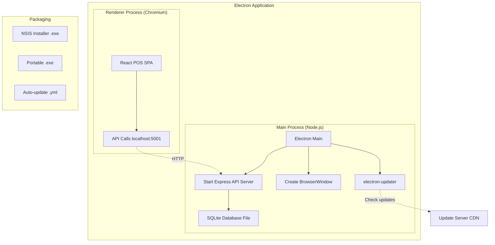

# Desktop Application Migration Plan

> Comprehensive plan for converting this web-based ERP/POS into a professional desktop application.

---

## Technology Comparison

| Framework | Language | Pros | Cons | Score |
|---|---|---|---|---|
| **Electron** | HTML/JS/TS | Reuse 100% of web UI + API; huge ecosystem; industry standard | Large bundle (100+ MB); Chromium memory; security model complex | ⭐⭐⭐⭐⭐ |
| **Tauri** | Rust + HTML/JS/TS | Small bundle (5-15 MB); OS WebView; better security; Rust backend | Rust learning curve; OS WebView inconsistencies; less mature | ⭐⭐⭐⭐ |
| **WPF / WinUI 3** | C# | Native Windows performance; excellent UX | Requires complete rewrite of UI and backend in C# | ⭐⭐ |
| **Avalonia UI** | C# | Cross-platform native; modern MVVM | Complete rewrite required | ⭐⭐ |
| **.NET MAUI** | C# | iOS/Android/Mac/Win | Mobile-first; complete rewrite; poor desktop UX | ⭐ |
| **Qt** | C++/Python | Maximum performance | Complete rewrite; complex Arabic/RTL handling | ⭐ |

---

## ✅ Recommended Technology: **Electron + Tauri hybrid strategy**

### Immediate Recommendation: **Electron**

**Why Electron wins for this project:**

1. **Zero UI rewrite** — The entire React POS frontend (`artifacts/pos/`) runs inside Electron's Chromium window as-is
2. **Zero backend rewrite** — The Express API server can run as a child process inside Electron, or embedded via Node.js integration
3. **SQLite already used** — `better-sqlite3` (already approved) works perfectly in Electron's Node.js main process
4. **Arabic RTL** — Chromium has perfect Arabic text rendering, right-to-left layout, and proper Arabic font support
5. **Thermal receipt printing** — The `window.print()` API in Chromium handles thermal printers with CSS `@page` rules
6. **Barcode scanner** — USB barcode scanners appear as keyboard input — works identically in Electron browser window
7. **Time to market** — Can have a working desktop app in days, not months
8. **Ecosystem** — `electron-updater` for auto-updates, `electron-builder` for packaging/signing

### Future Migration Path: **Tauri v2**

After initial Electron deployment, consider Tauri for:
- Smaller installers (customers on slow connections)
- Lower memory footprint on cashier machines
- Better sandboxing for security

The React frontend is fully reusable in Tauri — only the IPC layer changes.

---

## Migration Plan

### What Stays the Same (Code Reuse)

| Component | Status | Notes |
|---|---|---|
| `artifacts/pos/src/**` | ✅ Keep as-is | Entire React SPA unchanged |
| `artifacts/api-server/src/**` | ✅ Keep as-is | Express API unchanged |
| `lib/db/src/**` | ✅ Keep as-is | Drizzle schema unchanged |
| `lib/shared/src/**` | ✅ Keep as-is | Shared types unchanged |
| `lib/api-client-react/**` | ✅ Keep as-is | React Query hooks unchanged |
| SQLite database | ✅ Keep as-is | File-based, works natively |

### What Changes

| Component | Change Required | Effort |
|---|---|---|
| **Electron main process** | NEW: `main.js` — starts API server as child process, creates BrowserWindow | 1-2 days |
| **Build pipeline** | NEW: `electron-builder` config for Windows installer | 1 day |
| **Auto-updater** | NEW: `electron-updater` integration | 1-2 days |
| **Database path** | MINOR: Use `app.getPath('userData')` for SQLite file location | 2 hours |
| **CORS** | MINOR: Disable CORS (API and frontend in same process) | 30 min |
| **Environment config** | MINOR: Replace env vars with Electron config | 2 hours |
| **Print flow** | MINOR: Use Electron's `webContents.print()` for thermal receipts | 4 hours |

---

## New Desktop Architecture



---

## Implementation Steps

### Step 1: Electron Scaffold (Day 1)

```bash
# Create electron package in workspace
mkdir -p artifacts/desktop
cd artifacts/desktop

# Install electron
pnpm add -D electron electron-builder electron-updater concurrently
```

Create `artifacts/desktop/main.js`:
```javascript
const { app, BrowserWindow } = require('electron');
const { spawn } = require('child_process');
const path = require('path');

let apiProcess;
let mainWindow;

async function startApiServer() {
  apiProcess = spawn('node', ['../api-server/dist/index.mjs'], {
    env: {
      ...process.env,
      DATABASE_URL: path.join(app.getPath('userData'), 'store.db'),
      PORT: '5001',
      SESSION_SECRET: getOrCreateSecret(), // stored in OS keychain
    }
  });
}

function createWindow() {
  mainWindow = new BrowserWindow({
    width: 1400,
    height: 900,
    webPreferences: { contextIsolation: true },
    // No frame for custom title bar (optional)
  });
  mainWindow.loadURL('http://localhost:5000'); // or loadFile for bundled
}

app.whenReady().then(async () => {
  await startApiServer();
  await waitForApi(); // poll /health
  createWindow();
});
```

### Step 2: Database Migration (Day 1)

Change the SQLite path to use Electron's user data directory:

```javascript
// In main.js before starting API server
const dbPath = path.join(app.getPath('userData'), 'ShoeStorePOS', 'store.db');
```

On first launch, copy the bundled seed database or create fresh.

### Step 3: Build Configuration (Day 2)

`electron-builder.yml`:
```yaml
appId: com.yourcompany.shoepOS
productName: "Shoe Store POS"
directories:
  output: dist/desktop
win:
  target: nsis
  sign: true  # code signing certificate
nsis:
  oneClick: false
  allowToChangeInstallationDirectory: true
  createDesktopShortcut: true
  language: 1025  # Arabic
publish:
  provider: generic
  url: https://updates.yourserver.com/
```

### Step 4: Auto-Updater (Day 2-3)

```javascript
// In main.js
const { autoUpdater } = require('electron-updater');

autoUpdater.checkForUpdatesAndNotify();
autoUpdater.on('update-downloaded', () => {
  dialog.showMessageBox({
    message: 'تم تنزيل التحديث. سيتم التثبيت عند الإغلاق.',
    buttons: ['تثبيت الآن', 'لاحقاً']
  }).then(result => {
    if (result.response === 0) autoUpdater.quitAndInstall();
  });
});
```

---

## Database Considerations

| Concern | Web App | Desktop App |
|---|---|---|
| **Location** | Server filesystem | `%APPDATA%/ShoeStorePOS/store.db` |
| **Backup** | Server backup | Copy file to external drive |
| **Migration** | Push schema changes | Bundle migration script |
| **Multi-device** | Single server | Network share or cloud sync |

**Recommendation for multi-device (e.g., 2 cashier PCs):**
Use Turso (libSQL cloud) as the database backend — the connection URL changes from a file path to a Turso URL. All Drizzle queries remain identical.

---

## Offline Support

The current architecture is **already offline-capable** because:
- SQLite runs locally in Electron
- The Express API runs locally in Electron
- No external network dependencies for core operations

Offline capability comes for free with the Electron architecture.

---

## Printing (Thermal Receipts)

**Current:** `thermal-receipt.tsx` renders HTML + CSS → `window.print()` → browser print dialog

**Electron options:**
1. **Keep as-is** — `webContents.print()` in Electron bypasses print dialog and sends directly to printer. Preferred.
2. **Direct USB** — `node-thermal-printer` library for ESC/POS protocol if direct port communication is needed.

```javascript
// Direct print without dialog
mainWindow.webContents.print({
  silent: true,         // No dialog
  deviceName: '...',    // Thermal printer name from Windows
  pageSize: { width: 80000, height: 0 }, // 80mm
});
```

---

## Security Considerations

| Concern | Solution |
|---|---|
| SESSION_SECRET in env | Store in Windows Credential Manager via `keytar` |
| Database file access | Standard Windows file permissions (AppData is user-only) |
| Code signing | Purchase EV certificate; sign with `signtool.exe` |
| Update package integrity | electron-updater verifies SHA-512 of downloaded update |
| NodeIntegration | Keep `nodeIntegration: false` in renderer; use contextBridge IPC |
