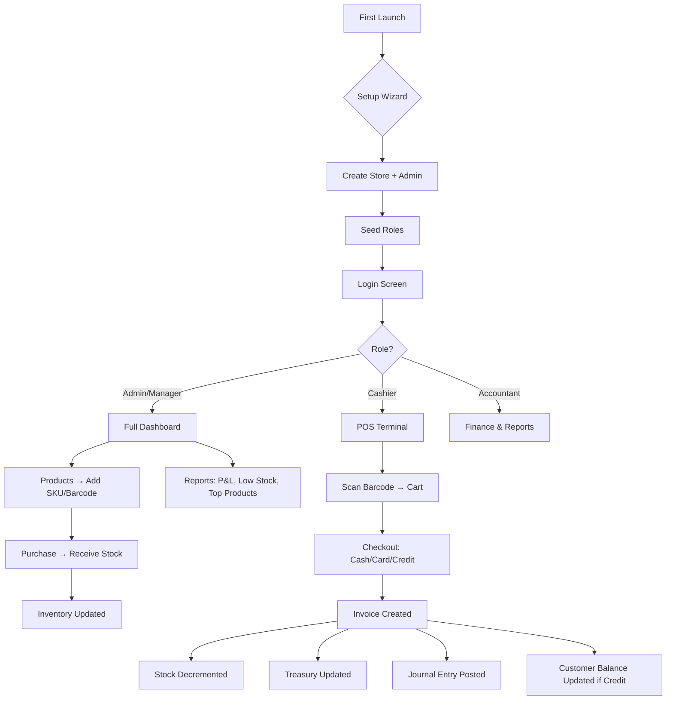
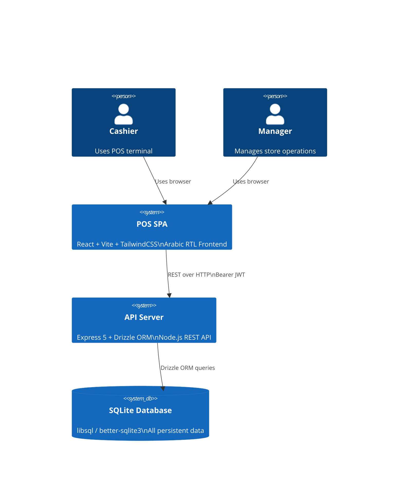

# Project Overview

## Purpose

This is a **full-featured Point-of-Sale (POS) and ERP system** built specifically for **Arabic-speaking shoe retail stores**. It covers the complete business lifecycle of a shoe shop: from receiving stock from suppliers, through daily cashier sales, to financial reporting and payroll.

**Primary goal:** Replace paper-based and fragmented spreadsheet operations with a unified, Arabic-first, real-time digital system that enforces accounting correctness, tracks every stock unit, and provides actionable business intelligence.

---

## Business Domain

| Domain | Specifics |
|---|---|
| **Industry** | Shoe retail (footwear) |
| **Business Model** | Single physical store / single-tenant ERP |
| **Geography** | Arabic-speaking markets (Egypt — default currency EGP) |
| **Scale** | Small-to-medium retail (1–50 employees) |
| **Language** | Arabic UI (RTL layout), English codebase |

---

## Main Modules

| # | Module | Arabic Name | Summary |
|---|---|---|---|
| 1 | **POS / Sales** | نقطة البيع | Cashier terminal: scan → cart → checkout |
| 2 | **Sales History** | سجل المبيعات | Browse/search invoices, view details |
| 3 | **Sales Returns** | مرتجعات المبيعات | Accept returned goods, refund to treasury |
| 4 | **Purchases** | المشتريات | Receive stock from suppliers, pay invoices |
| 5 | **Purchase Returns** | مرتجعات المشتريات | Return defective goods back to suppliers |
| 6 | **Products & Catalog** | المنتجات | Products, variants (size+color), SKU/barcode |
| 7 | **Inventory** | المخزون | Per-warehouse stock, movements, transfers, counts |
| 8 | **Customers** | العملاء | Customer ledger, credit sales, debt collection |
| 9 | **Suppliers** | الموردون | Supplier ledger, payables, payments |
| 10 | **Treasury** | الخزينة | Cash/Card/InstaPay/Wallet drawers, sessions |
| 11 | **Finance** | المالية | Expenses, employees, salaries, owner equity |
| 12 | **Accounting** | المحاسبة | Double-entry journal, chart of accounts |
| 13 | **Reports** | التقارير | Sales, P&L, inventory, treasury, top products |
| 14 | **Admin** | الإدارة | Users, roles, permissions, audit log, settings |

---

## Target Users

| Role | Arabic | Access Level |
|---|---|---|
| **Admin (Owner)** | مدير النظام | Full system access (`*` wildcard) |
| **Manager** | مدير | All ops except user/role management |
| **Cashier** | كاشير | POS terminal only, expense entry |
| **Inventory Staff** | موظف مخزون | Products, purchases, inventory |
| **Accountant** | محاسب | Finance, treasury, reports (no sales create) |

> Roles are defined in [`lib/shared/src/roles.ts`](file:///c:/Users/moham/Downloads/Shoe-Store-Design/Shoe-Store-Design/lib/shared/src/roles.ts) and seeded at setup.

---

## Application Workflow

---

## Overall Architecture

---

## High-Level System Design

The system follows a classic **3-tier architecture**:

| Tier | Technology | Responsibility |
|---|---|---|
| **Presentation** | React 18 + Vite + TailwindCSS | RTL UI, routing, state, API calls |
| **Application** | Express 5 + TypeScript | Business logic, auth, validation |
| **Data** | SQLite via libsql/Drizzle ORM | Persistent storage, transactions |

**Key design decisions:**
- **Single SQLite file** — simple deployment, zero external DB server needed for single-store
- **Double-entry accounting** — every financial event auto-generates balanced journal entries
- **Immutable ledgers** — `inventory_movements` and `treasury_transactions` are append-only, never updated
- **Transactional consistency** — each sale/purchase writes inventory + treasury + accounting in one `db.transaction()`
- **Multi-tenant-ready** — every table has `storeId` FK for future SaaS expansion
